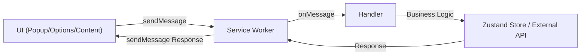
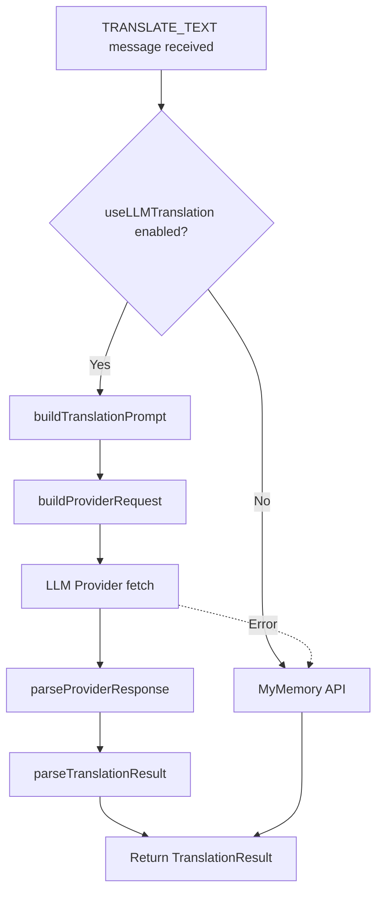
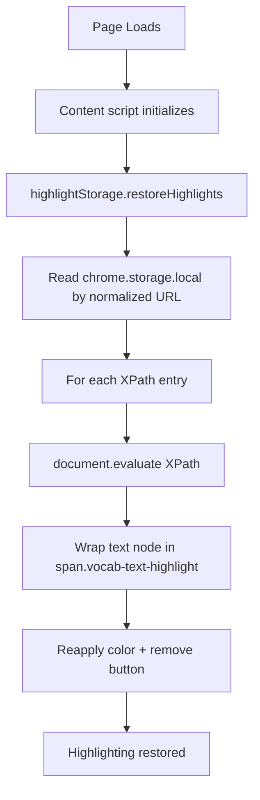

# System Architecture

**Vocabulary Builder Chrome Extension v1.0.5**

---

## High-Level Overview

```
┌─────────────────────────────────────────────────────────────────┐
│                    Chrome Extension Surfaces                     │
├─────────────────────────────────────────────────────────────────┤
│                                                                   │
│  ┌─────────────┐  ┌──────────────┐  ┌─────────┐  ┌────────────┐ │
│  │   Popup     │  │   Options    │  │ SidePanel│  │  Content   │ │
│  │  (React UI) │  │  (React UI)  │  │ (React) │  │  (Script)  │ │
│  │ Dashboard   │  │ Learning     │  │ PDF     │  │ Tooltip    │ │
│  │ Study       │  │ Translation  │  │ Lookup  │  │ Menu       │ │
│  │ Vocabulary  │  │ Data Mgmt    │  │ History │  │ Highlight  │ │
│  └──────┬──────┘  └──────┬───────┘  └────┬────┘  └──────┬──────┘ │
│         │                │               │              │         │
│         └────────────────┼───────────────┴──────────────┘         │
│                          │                                         │
│              chrome.runtime.sendMessage / onMessage               │
│                          │                                         │
│         ┌────────────────▼────────────────┐                      │
│         │   Background Service Worker     │                      │
│         │  (Message Router & Handlers)    │                      │
│         ├────────────────────────────────┤                      │
│         │ ├─ audio-handler               │                      │
│         │ ├─ notification-handler        │                      │
│         │ ├─ options-handler             │                      │
│         │ ├─ pdf-handler                 │                      │
│         │ ├─ translation-handler         │                      │
│         │ ├─ word-handler                │                      │
│         │ └─ context-menu init           │                      │
│         └──────┬──────────────┬──────────┘                      │
│                │              │                                   │
│         ┌──────▼──┐    ┌──────▼──────────────┐                  │
│         │External │    │ chrome.storage.local │                  │
│         │ APIs    │    │ chrome.alarms        │                  │
│         │ - TTS   │    │ chrome.notifications │                  │
│         │ - Dict  │    │ chrome.storage.onChanged│               │
│         │ - Trans │    │                      │                  │
│         │ - LLM   │    └──────┬───────────────┘                  │
│         └─────────┘           │                                   │
│                        ┌──────▼───────────┐                      │
│                        │  Shared Layer    │                      │
│                        │  (Zustand Store) │                      │
│                        │ ├─ useVocabulary │                      │
│                        │ ├─ useStats      │                      │
│                        │ ├─ useSettings   │                      │
│                        │ └─ useUI         │                      │
│                        └──────────────────┘                      │
│                                                                   │
└─────────────────────────────────────────────────────────────────┘
```

---

## Architecture Layers

### 1. Presentation Layer (React UIs)

Four independent UIs, each with own entry point:

#### **Popup** (`src/popup/`)
- **Triggered:** Click extension icon in toolbar
- **Surfaces:** 3 tabs (Dashboard, Study, Vocabulary)
- **State:** `useVocabularyStore`, `useStatsStore` (read-only), `useUIStore` (tab selection)
- **Key flows:** View stats, study flashcards (rate via SM-2), search vocabulary

#### **Options** (`src/options/`)
- **Triggered:** Right-click extension icon → Options / Settings
- **Surfaces:** Learning, Translation, Data Management, About
- **State:** `useSettingsStore` (read-write)
- **Key flows:** Configure daily goal, notifications, LLM API keys, language, export/import data

#### **Side Panel** (`src/sidepanel/`)
- **Triggered:** Chrome 114+ side panel (manual user open or via PDF lookup)
- **Surfaces:** History list, result card (Word or Translation)
- **State:** `useVocabularyStore`, `useSettingsStore`
- **Key flows:** View lookup history, re-translate with different provider/language

#### **Content Script** (`src/content/`)
- **Injected:** All pages (`<all_urls>`)
- **Surfaces:** Tooltip (floating), floating menu, highlight spans
- **State:** Settings cached from `chrome.storage.onChanged` listener
- **Key flows:** Right-click word → tooltip, mouseup select → menu, save → highlight

### 2. Message Layer (Chrome Runtime)

Service worker routes messages via `chrome.runtime.onMessage`. Each handler is a pure function:

```typescript
const handler = async (message: Message, sender) => {
  // validate message type via discriminated union
  // execute business logic
  // return Promise<ResponseType>
};
```

**11 Message Contracts:**

| Action | Payload In | Response Out | Handler |
|--------|-----------|--------------|---------|
| `LOOKUP_WORD` | `{ word: string, context?: string }` | `Word` object | word-handler |
| `LOOKUP_SELECTED` | `{ text: string }` | `Word` object | word-handler |
| `TRANSLATE_TEXT` | `{ text: string, targetLanguage?: string }` | `TranslationResult` | translation-handler |
| `TRANSLATE_SWAP` | `{ text, sourceLang, targetLang }` | `TranslationResult` | translation-handler |
| `SAVE_WORD` | `{ word: Word }` | `void` | word-handler |
| `PLAY_AUDIO` | `{ text: string, lang?: string }` | `{ audioDataUrl: string }` | audio-handler |
| `UPDATE_REMINDER` | `{ enabled: bool, interval?: number }` | `void` | notification-handler |
| `OPEN_OPTIONS_PAGE` | `{ hash?: string }` | `void` | options-handler |
| `TEST_NOTIFICATION` | (none) | `{ success: bool }` | notification-handler |
| `SHOW_LOADING` | `{ text, isPhrase }` | (broadcast) | internal, BG→Content |
| `SHOW_TOOLTIP` / `SHOW_TRANSLATION` | `Word` / `TranslationResult` | (broadcast) | internal, BG→Content |

### 3. Shared/State Layer (Zustand + Chrome Storage)

Four domain stores, persisted via `chromeStorage` adapter to `chrome.storage.local`:

#### **useVocabularyStore**
```typescript
{
  words: Word[]                      // Saved words + flashcard state
  flashcards: Map<wordId, FlashcardData>  // SM-2 data per word
  addWord: (word: Word) => void      // Persist on save
  updateFlashcard: (id, data) => void
}
```

#### **useStatsStore**
```typescript
{
  xp: number
  streak: number
  level: number
  dailyGoal: number
  lastStudyDate: Date | null
  incrementXP: (amount) => void
  updateStreak: () => void
}
```

#### **useSettingsStore**
```typescript
{
  targetLanguage: string
  useLLMTranslation: boolean
  llmProvider: LLMProvider
  llmModel: string
  dailyReminderTime: string | null
  reminderEnabled: boolean
  // ... more settings
}
```

#### **useUIStore**
```typescript
{
  activeTab: 'dashboard' | 'study' | 'vocabulary'
  setActiveTab: (tab) => void
}
```

**Persistence:** `chromeStorage` middleware intercepts store updates and persists to `chrome.storage.local`. On startup, restores from storage.

**Cross-Tab Sync:** Settings changes trigger `chrome.storage.onChanged` listener in content script; all tabs re-read settings automatically.

### 4. Business Logic Layer (Services)

#### **Translation Service** (`shared/translation-service.ts`)

Decision tree:
1. If `useLLMTranslation` enabled + `apiKey` present:
   - Call `buildTranslationPrompt` → `buildProviderRequest` (provider-specific)
   - Fetch from LLM provider (OpenAI, Gemini, Grok, OpenRouter, Groq, Mistral)
   - Parse response via `parseProviderResponse` → `parseTranslationResult`
   - Return `TranslationResult` with synonyms/antonyms/notes
2. Else (free mode):
   - Call MyMemory API via `translateWithFreeApi`
   - Return basic translated text

**Fallback:** If LLM fails, retry with free API. If free fails, return error.

#### **Spaced Repetition** (`shared/spaced-repetition.ts`)

SM-2 algorithm on rating a flashcard (quality 1–5):

```typescript
const calculateNextReview = (
  card: FlashcardData,
  quality: 1 | 2 | 3 | 4 | 5
): FlashcardData => {
  if (quality < 3) {
    // Fail: reset repetitions, interval back to 1 day
    return { ...card, reps: 0, interval: 1, nextReview: tomorrow };
  } else {
    // Success: adjust EF, increment reps, compute new interval
    const newEF = Math.max(1.3, card.ef + (0.1 - (5 - quality) * 0.08));
    const newReps = card.reps + 1;
    const newInterval = newReps === 1 ? 1 : (newReps === 2 ? 3 : card.interval * newEF);
    return { ...card, ef: newEF, reps: newReps, interval: newInterval, nextReview: addDays(now, newInterval) };
  }
};
```

`getPredictedIntervals(card)` returns labels for rating buttons ("Easy: 4d", "Hard: 1d", etc.).

#### **Notification Service** (`shared/notifications.ts`)

- `showDailyReminder(text)`: Shows notification with random word preview
- `initNotifications()`: Sets up `chrome.alarms.onAlarm` listener for daily reminder
- Triggered by `UPDATE_REMINDER` message from options page

#### **Dictionary API** (`shared/dictionary-api.ts`)

Free Dictionary API integration (no auth):
- `lookupWord(word)`: Returns `Word` with definitions, examples, phonetic, part-of-speech

#### **TTS** (`shared/tts.ts`)

Google TTS bridge:
- `playPronunciation(text, lang)`: Sends `PLAY_AUDIO` message → audio-handler → returns base64 data URL
- Content script / popup plays via `HTMLAudioElement`

### 5. Content Script (Page Interaction)

Modular initialization in `content-script.ts`:

1. **Settings Manager** — Cache settings, listen to `chrome.storage.onChanged` for sync
2. **Tooltip Manager** — Show/hide tooltip DOM
3. **Tooltip Positioning** — Viewport-aware coords (prefers saved position from floating menu)
4. **Floating Menu** — Mouseup selection handler (lookup/speak/highlight buttons)
5. **Highlight Renderer** — Wrap text in `<span class="vocab-text-highlight">` + remove button
6. **Highlight Storage** — Persist XPath + offset to `chrome.storage.local` keyed by normalized URL
7. **Keyboard Shortcuts** — Optional Alt+M / Cmd+Shift+M as alternative to mouseup
8. **TTS Player** — Play audio data URLs with error toast fallback

**Lifecycle Flow:**

```
User right-clicks word on page
         ↓
Content script detects selection via mouseup event
         ↓
Floating menu appears near cursor (captures Range)
         ↓
User clicks "Look up" button
         ↓
Content script sends LOOKUP_WORD message → BG
         ↓
BG handler calls Free Dictionary API
         ↓
BG sends SHOW_LOADING message → Content
         ↓
Tooltip appears at selection coords (or saved position from menu)
         ↓
BG calls translation-service (free or LLM) based on settings
         ↓
BG sends SHOW_TOOLTIP message → Content
         ↓
Tooltip updates with word + translation + buttons
         ↓
User clicks "Save" button
         ↓
Content script sends SAVE_WORD message → BG
         ↓
BG persists to useVocabularyStore (persisted to chrome.storage.local)
         ↓
Flashcard + SM-2 state initialized
```

---

## Data Flow Diagrams

### Message Flow (Simplified)



### Translation Pipeline



### Highlight Persistence (Page Reload)



---

## Component Hierarchy

### Popup

```
App
├── Header (logo, stats bar)
├── TabNav (Dashboard | Study | Vocabulary)
└── ActiveTab (conditional render)
    ├── Dashboard
    │   ├── StatsGrid (XP, streak, level, progress)
    │   └── QuickActions (Start Study, View Vocabulary)
    ├── StudyView
    │   ├── StudyProgressHeader (progress bar)
    │   ├── Flashcard (word + definition, flip button)
    │   ├── RatingButtons (1–5 buttons with predicted intervals)
    │   └── StudyNavigation (prev/next)
    └── VocabularyList
        ├── SearchInput
        └── WordCard[] (each with edit/delete actions)
```

### Options

```
Options
├── Header (logo, version)
└── SettingsContent
    ├── LearningSettings (daily goal, audio toggle, notifications, shortcuts)
    ├── TranslationSettings (target lang, AI toggle, provider selector, API key input)
    ├── HighlightSettings (color presets + custom picker)
    ├── DataManagement (export/import JSON)
    └── AboutSection (version, support links)
```

### Side Panel

```
SidePanel
├── PanelHeader (Clear history)
├── EmptyState | ErrorState | HistoryList
│   └── ResultCard[] (router: Word vs Translation)
│       ├── WordResultCard (word + pronunciation + definitions)
│       └── TranslationResultCard (translated text + re-translate dropdown)
└── Hooks
    ├── useSidepanelData (listens LOOKUP_WORD / TRANSLATE_TEXT)
    └── useRetranslate (switches lang/provider)
```

---

## Storage Schema

### chrome.storage.local

Persisted via Zustand `chromeStorage` adapter:

```javascript
{
  "vocabulary-store": {
    words: [
      { id, text, definition, phonetic, partOfSpeech, translation, context, savedAt },
      ...
    ],
    flashcards: [[wordId, { ef: 2.5, reps: 3, interval: 7, nextReview: "2026-05-15T10:00:00Z" }], ...]
  },
  "stats-store": {
    xp: 1250,
    streak: 8,
    level: 5,
    dailyGoal: 20,
    lastStudyDate: "2026-05-08T14:30:00Z"
  },
  "settings-store": {
    targetLanguage: "vi",
    useLLMTranslation: true,
    llmProvider: "openai",
    llmModel: "gpt-4",
    apiKey: "[encrypted by Chrome]",
    dailyReminderTime: "08:00",
    reminderEnabled: true,
    // ... more settings
  },
  "ui-store": {
    activeTab: "study"
  },
  "highlights": {
    "https://example.com/article": [
      { xpath: "/html/body/p[2]/text()[3]", offset: 5, length: 4, color: "#FFF59D" },
      ...
    ]
  }
}
```

### chrome.storage.session (Temporary)

Used for PDF lookups (content script can't inject into native PDF viewer, so BG stores result):

```javascript
{
  "pdf-lookup-result": { word: Word, timestamp: Date }
}
```

---

## Security Model

- **Content Security Policy (CSP):** Defined in manifest.ts; blocks inline scripts
- **XSS Protection:** User-generated content (word text) HTML-escaped before DOM insertion via `htmlEscape` util
- **API Key Storage:** Stored in `chrome.storage.local`; Chrome handles encryption at rest
- **Host Permissions:** Manifest specifies allowed external APIs (MyMemory, Dictionary, OpenAI, Gemini, Grok, Google Translate)
- **No Background Page:** Service worker only (Chrome MV3 requirement); no persistent script injection

---

## Scalability Considerations

- **Word limit:** ~10,000 words in `chrome.storage.local` (10 MB Chrome quota soft limit)
- **Highlight limit:** XPath storage per URL; no deduplication; for 100+ highlights per page, consider pagination
- **API rate limits:** Free Dictionary API ~100 req/min; MyMemory ~1000 req/day; LLM providers per plan
- **Settings sync:** `chrome.storage.onChanged` fires per setting change; no batching

---

## Open Questions / Clarifications Needed

1. **Firebase dependency** — Confirm if dead code or planned cloud-sync feature; if cloud sync planned, architecture will change significantly
2. **PDF URL detection** — How to reliably detect PDF context; current approach uses `isPdfUrl` heuristic
3. **Highlight restoration on dynamic DOM** — XPath resolution breaks on single-page app DOM mutations; consider MutationObserver + ResizeObserver if SPA support needed
